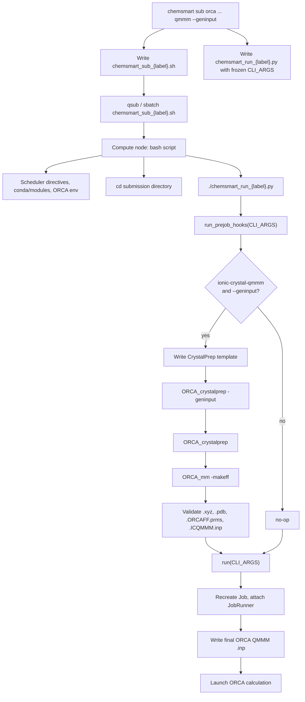

# ORCA Ionic-Crystal QM/MM with `--geninput`

This document describes how CHEMSMART prepares and submits ionic-crystal QM/MM
jobs when `--geninput` is used on the ORCA `qmmm` subcommand with
`--jobtype ionic-crystal-qmmm`.

The workflow separates **CrystalPrep template generation** (consumed by
`ORCA_crystalprep`) from **final ORCA QMMM input generation** (consumed by the
ORCA program for the actual calculation).

## Overview

On the login node, `chemsmart sub` builds a `Job` object and writes two scripts
in the submission directory:

| File | Role |
|------|------|
| `chemsmart_sub_{label}.sh` | Scheduler setup and environment activation |
| `chemsmart_run_{label}.py` | Compute-node wrapper that runs prejob hooks, then `chemsmart run` |

CrystalPrep / ORCA_mm utility commands run inside the Python prejob hook on
the compute node. They are **not** embedded in `chemsmart_sub_{label}.sh`.

## End-to-end flow



## 1. Login node: `chemsmart sub`

`chemsmart sub orca ... qmmm --jobtype ionic-crystal-qmmm --geninput ...` does
**not** run the calculation. It:

1. Parses CLI flags and builds a `Job` object.
2. Reconstructs the equivalent `chemsmart run ...` argument list (`CLI_ARGS`).
3. Writes `chemsmart_sub_{label}.sh` and `chemsmart_run_{label}.py`.
4. Submits the shell script to the cluster scheduler (unless `--test` is set).

Use `--test` to inspect the generated scripts without submitting.

## 2. `chemsmart_sub_{label}.sh`

The submission script is scheduler- and environment-focused. It typically:

1. Writes scheduler directives (`#PBS`, `#SBATCH`, …).
2. Activates conda environments and loads modules.
3. Exports program-specific environment variables (ORCA paths, scratch, etc.).
4. Runs any server `EXTRA_COMMANDS`.
5. Changes to the submission directory (`$PBS_O_WORKDIR`, `$SLURM_SUBMIT_DIR`, …).
6. Launches the Python wrapper:

```bash
chmod +x ./chemsmart_run_{label}.py
./chemsmart_run_{label}.py &
wait
```

The shell script does **not** call `ORCA_crystalprep`, `ORCA_mm`, or `orca`
directly.

## 3. `chemsmart_run_{label}.py`

Every submitted job receives the same Python wrapper structure:

```python
#!/usr/bin/env python
import os
os.environ['OMP_NUM_THREADS'] = '1'

from chemsmart.cli.run import run
from chemsmart.cli.prejob import run_prejob_hooks

CLI_ARGS = [...]  # reconstructed from the original chemsmart sub command

def run_job():
    run_prejob_hooks(CLI_ARGS)
    run(CLI_ARGS)

if __name__ == '__main__':
    run_job()
```

`CLI_ARGS` is a frozen copy of the arguments needed to recreate the job through
the normal `chemsmart run` pipeline.

## 4. Prejob hook: ionic-crystal CrystalPrep

`run_prejob_hooks(CLI_ARGS)` dispatches to registered hooks. For ORCA
ionic-crystal QM/MM jobs with `--geninput`, `maybe_run_orca_crystalprep_prejob`
(in `chemsmart/jobs/orca/crystalprep.py`) runs before `run(CLI_ARGS)`.

When active, the hook:

1. Builds `CrystalPrepOptions` from `--cp-*` flags in `CLI_ARGS`.
2. Writes the CrystalPrep template (default `{cif_stem}.cp.inp`, or
   `--cp-template-out`).
3. Runs utility commands in order:
   - `ORCA_crystalprep "$CP_TEMPLATE" -geninput`
   - `ORCA_crystalprep "$CP_TEMPLATE"`
   - `ORCA_mm -makeff "$SUPERCELL_XYZ" -CEL …`
4. Validates expected files after each stage:
   - CrystalPrep template
   - supercell `.xyz` and `.pdb`
   - `.ORCAFF.prms`
   - `.ICQMMM.inp` (when `DoICQMMMInput` is enabled)
5. Raises `CrystalPrepPrejobError` and stops if a command fails or a file is
   missing.

For all other jobs, or for ionic-crystal QMMM **without** `--geninput`, the hook
is a no-op and control passes straight to `run(CLI_ARGS)`.

## 5. Normal `run(CLI_ARGS)` pipeline

After prejob hooks complete, `run(CLI_ARGS)` executes the standard CHEMSMART
run path:

1. Subcommands recreate the `Job` from project settings and CLI flags.
2. A program-specific `JobRunner` is attached.
3. The runner writes (or validates) the **final ORCA QMMM `.inp`** file.
4. ORCA is launched for the actual calculation.

This path is unchanged for non-`--geninput` jobs.

## Two input files: CrystalPrep vs final QMMM

| | CrystalPrep template | Final ORCA QMMM input |
|---|---------------------|----------------------|
| **Purpose** | Drives `ORCA_crystalprep` / `ORCA_mm` preparation | Submitted to ORCA for the QM/MM calculation |
| **Writer** | `CrystalPrepInputWriter` | Existing ORCA QMMM input writer |
| **CLI flags** | `--cp-*` (`--cp-input-cif`, `--cp-scdimension`, `--cp-atomtype`, …) | `--high-level-functional`, `--high-level-basis`, `--low-level-method`, `--charge-high`, `--mult-high`, `%qmmm` options, … |
| **When written** | Prejob hook on compute node (with `--geninput`) | Normal `JobRunner` during `run(CLI_ARGS)` |
| **Example** | `NaCl.cp.inp` | `{label}.inp` |

The CrystalPrep template is **not** the file passed to `orca` for the final
energy calculation.

## Example: NaCl ionic-crystal QM/MM with `--geninput`

```bash
chemsmart sub -s myserver orca -p myproject \
  -f NaCl.cif \
  sp qmmm \
  --jobtype ionic-crystal-qmmm \
  --geninput \
  --cp-input-cif NaCl.cif \
  --cp-scdimension 15x15x15 \
  --cp-atomtype Na 0 1.0 0.0 \
  --cp-atomtype Cl 1 -1.0 0.0 \
  --high-level-functional PBE \
  --high-level-basis def2-SVP \
  --low-level-method NaCl.cif_15x15x15.ORCAFF.prms \
  --use-qm-info-from-pdb \
  --use-qm3-info-from-pdb \
  --ecp-layer-ecp SDD \
  --conv-charges \
  --enforce-total-charge true \
  --charge-total 0 \
  --charge-high 19 \
  --mult-high 1 \
  --print-level 2
```

### Flag groups in the example

**CrystalPrep template (`--cp-*`):**

- `--geninput` — enable the prejob CrystalPrep / ORCA_mm path
- `--cp-input-cif NaCl.cif` — CIF read by `ORCA_crystalprep` (defaults to `-f` when it is a `.cif`)
- `--cp-scdimension 15x15x15` — supercell dimensions
- `--cp-atomtype Na 0 1.0 0.0` / `--cp-atomtype Cl 1 -1.0 0.0` — atom types for the template and `ORCA_mm -makeff`

**Final ORCA QMMM input (existing QMMM flags):**

- `--high-level-functional`, `--high-level-basis` — QM region in `%qmmm`
- `--low-level-method` — ORCAFF parameter file for the MM region
- `--use-qm-info-from-pdb`, `--use-qm3-info-from-pdb` — region definitions from the supercell PDB
- `--ecp-layer-ecp`, `--conv-charges`, `--enforce-total-charge` — `%qmmm` block options
- `--charge-high`, `--mult-high`, `--charge-total`, `--print-level` — charge, multiplicity, and output level

### Expected artifacts (after a successful run)

From the prejob hook (names inferred from CIF + supercell dimension):

- `NaCl.cp.inp` — CrystalPrep template
- `NaCl.cif_15x15x15.xyz`, `NaCl.cif_15x15x15.pdb`
- `NaCl.cif_15x15x15.ORCAFF.prms`
- `NaCl.cif_15x15x15.xyz.ICQMMM.inp` (when `DoICQMMMInput` is enabled)

From the normal run pipeline:

- `{label}.inp` — final ORCA QMMM input for the calculation
- `{label}.out`, GBW, and other ORCA outputs

## Backward compatibility

- Non-ionic-crystal jobs are unchanged.
- Ionic-crystal QMMM jobs **without** `--geninput` skip the CrystalPrep prejob
  hook; only the normal `run(CLI_ARGS)` path runs.
- All jobs receive `run_prejob_hooks(CLI_ARGS)` in `chemsmart_run_{label}.py`,
  but the hook is a no-op unless both `--geninput` and
  `--jobtype ionic-crystal-qmmm` are present in `CLI_ARGS`.

## Related modules

| Module | Responsibility |
|--------|----------------|
| `chemsmart/cli/sub.py` | Login-node submission; writes scripts |
| `chemsmart/settings/submitters.py` | Generates `chemsmart_sub_*.sh` and `chemsmart_run_*.py` |
| `chemsmart/cli/prejob.py` | Prejob hook registry |
| `chemsmart/jobs/orca/crystalprep.py` | Ionic-crystal CrystalPrep prejob execution |
| `chemsmart/cli/orca/qmmm.py` | `--geninput` and `--cp-*` CLI parsing |
| `chemsmart/jobs/orca/writer.py` | `CrystalPrepInputWriter` and final QMMM input writer |
